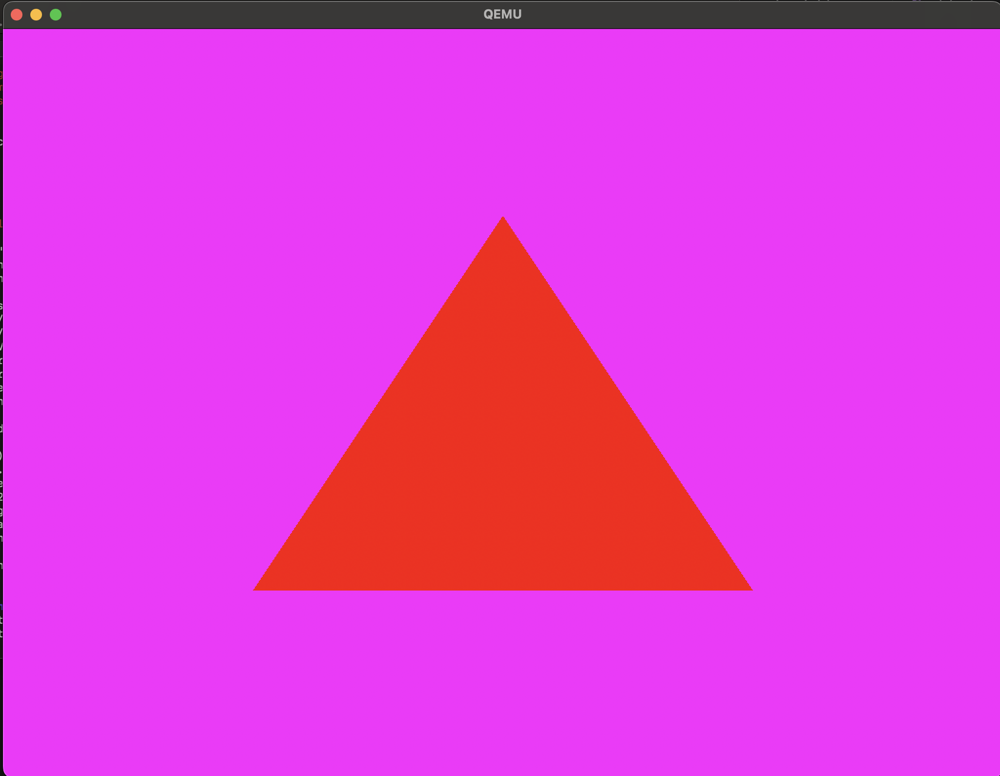

# 🌙 Luna-OS 🐱‍🚀
**Kernel Mode Gaming Operating System**

## What's Working So Far? ✅
- **Memory allocation with paging.** 🧠  
- **32-bit 2D and 3D graphics** (via MicroGL and PortableGL) 🎨  
- **Standard C library functions.** 📚  

### Screenshots and Demos 📸🎥

## Licensing Info 📜
- **Kernel**: Public Domain 🙌  
- **uFat Library**: BSD License 📝  
- **pdlibc**: Public Domain 🆓  
- **MicroGL & PortableGL**: Follow their own respective licensing. 🔍  
- **PortableGL** will be replaced with **LunaGL** (a Public Domain implementation of the OpenGL 3.0 standard) 🌟  

## Future Developments 🔮
- **rUgly Library**: Our Public Domain replacement for uFat is in the works! 🛠️  